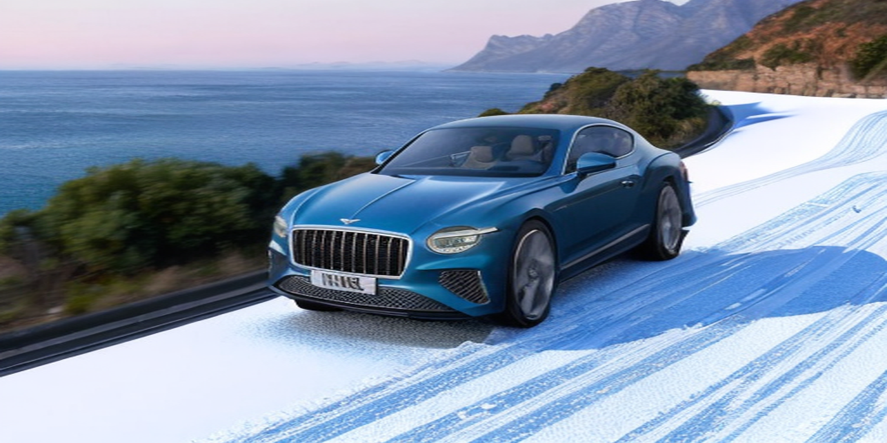
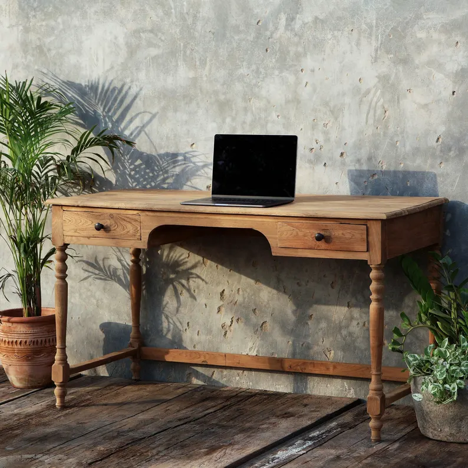
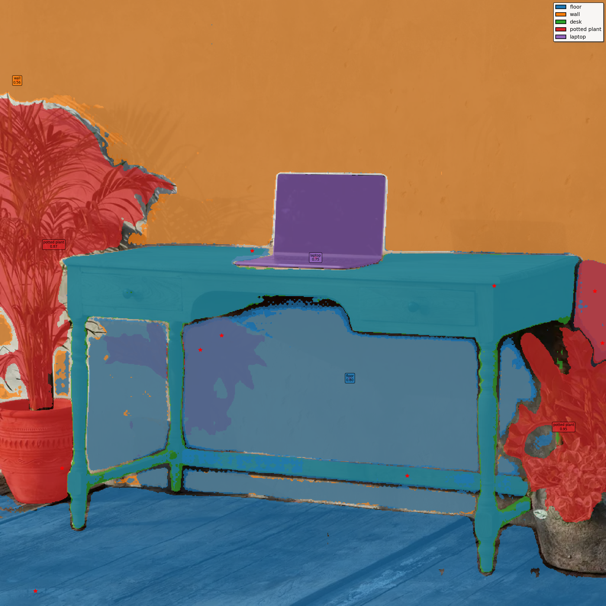

# Examples

This directory contains test images and videos for demonstrating CLIP-guided segmentation capabilities.

## Directory Structure

- `examples/` - Source images and videos
- `examples_results/` - Output segmentation results

## Test Cases

### MotoGP Racing

Segment motorcycle racing scenes with riders and environment.

**Single Frame:**
```bash
python clip_guided_segmentation.py \
    --image examples/motogp_frame.png \
    --vocabulary "Valentino Rossi Yamaha" "Marc Marquez Honda" track background grass \
    --output examples_results/motogp_frame
```

<table>
<tr>
<td width="50%">

**Input**


</td>
<td width="50%">

**Output**


</td>
</tr>
</table>

**Video:**
```bash
python clip_guided_segmentation.py \
    --image examples/motogp_video.mp4 \
    --vocabulary "Valentino Rossi Yamaha" "Marc Marquez Honda" track background grass \
    --output examples_results/motogp_video
```

<table>
<tr>
<td width="50%">

**Input Video**

https://github.com/user-attachments/assets/motogp_video.mp4

<video src="motogp_video.mp4" controls controlsList="nodownload" style="width: 100%;" preload="metadata"></video>

</td>
<td width="50%">

**Output Video**

https://github.com/user-attachments/assets/motogp_video_output.mp4

<video src="../examples_results/motogp_video.mp4" controls controlsList="nodownload" style="width: 100%;" preload="metadata"></video>

</td>
</tr>
</table>

- **Classes:** Riders (Rossi, Marquez), track, background, grass

---

### NBA Basketball

Segment basketball players and court elements.

**Single Frame:**
```bash
python clip_guided_segmentation.py \
    --image examples/nba_frame.png \
    --vocabulary "Stephen Curry" "LeBron James" floor crowd background \
    --output examples_results/nba_frame
```

<table>
<tr>
<td width="50%">

**Input**


</td>
<td width="50%">

**Output**


</td>
</tr>
</table>

**Video:**
```bash
python clip_guided_segmentation.py \
    --image examples/nba_video.mp4 \
    --vocabulary "Stephen Curry" "LeBron James" floor crowd background \
    --output examples_results/nba_video
```

<table>
<tr>
<td width="50%">

**Input Video**

<video src="nba_video.mp4" controls controlsList="nodownload" style="width: 100%;" preload="metadata"></video>

</td>
<td width="50%">

**Output Video**

<video src="../examples_results/nba_video.mp4" controls controlsList="nodownload" style="width: 100%;" preload="metadata"></video>

</td>
</tr>
</table>

- **Classes:** Players (Curry, LeBron), floor, crowd, background

---

### Football/Soccer

Segment football players from FC Barcelona.

**Standard Segmentation:**
```bash
python clip_guided_segmentation.py \
    --image examples/football_frame.png \
    --vocabulary "Lionel Messi" "Luis Suarez" "Neymar Jr" grass crowd background \
    --output examples_results/football_frame
```

**Educational Visualization (18 Steps + Interactive HTML):**
```bash
python clip_guided_sam_explanatory.py \
    --image examples/football_frame.png \
    --vocabulary "Lionel Messi" "Luis Suarez" "Neymar Jr" grass crowd background \
    --output explanatory_results/football \
    --min-confidence 0.3 \
    --points-per-cluster 1 \
    --negative-points-per-cluster 2 \
    --create-html

# Then open: explanatory_results/football/index.html
```

See [EXPLANATORY_VISUALIZATION_README.md](../EXPLANATORY_VISUALIZATION_README.md) for complete documentation.

<table>
<tr>
<td width="50%">

**Input**


</td>
<td width="50%">

**Output**


</td>
</tr>
</table>

- **Classes:** Players (Messi, Suarez, Neymar), grass, crowd, background

---

### Celebrity Recognition

Segment famous people in public events.

```bash
python clip_guided_segmentation.py \
    --image examples/obama_jordan.png \
    --vocabulary "Obama" "Michael Jordan" people background \
    --output examples_results/obama_jordan
```

<table>
<tr>
<td width="50%">

**Input**


</td>
<td width="50%">

**Output**


</td>
</tr>
</table>

- **Classes:** Obama, Michael Jordan, people, background

---

### Product/Brand Segmentation

Segment shoes from different brands.

```bash
python clip_guided_segmentation.py \
    --image examples/brands.png \
    --vocabulary "Nike Shoe" "Adidas Sneaker" background \
    --output examples_results/brands
```

<table>
<tr>
<td width="50%">

**Input**


</td>
<td width="50%">

**Output**


</td>
</tr>
</table>

- **Classes:** Nike shoes, Adidas sneakers, background

---

### F1 Podium Ceremony

Segment F1 drivers and podium elements.

```bash
python clip_guided_segmentation.py \
    --image examples/podium.png \
    --vocabulary champagne background hat "red bull driver" "Lewis Hamilton" podium hand \
    --output examples_results/podium
```

<table>
<tr>
<td width="50%">

**Input**


</td>
<td width="50%">

**Output**


</td>
</tr>
</table>

- **Classes:** Champagne, background, hat, Red Bull driver, Lewis Hamilton, podium, hand

---

### Car Sky Replacement

Segment and replace the sky in a scenic car image with inpainting.

```bash
python clip_guided_segmentation.py \
  --image examples/car.jpg \
  --vocabulary sky car road sea mountain background \
  --prompt "sky" \
  --edit replace \
  --use-inpainting \
  --edit-prompt "realistic sunset with a reddish sky" \
  --output examples_results/car-sky-replacement
```

<table>
<tr>
<td width="33%">

**Original Image**


</td>
<td width="33%">

**Segmentation**


</td>
<td width="33%">

**Sky Replaced**


</td>
</tr>
</table>

- **Operation:** Replace sky segment with sunset using Stable Diffusion inpainting
- **Classes:** Sky, car, road, sea, mountain, background
- **Edit Prompt:** "realistic sunset with a reddish sky"
- **Results stored in:** `examples_results/car-sky-replacement*.png`

---

### Car Road to Ski Slope

Transform the road into a snowy ski slope using inpainting.

```bash
python clip_guided_segmentation.py \
  --image examples/car.jpg \
  --vocabulary sky car road sea mountain background \
  --prompt "road" \
  --edit replace \
  --use-inpainting \
  --edit-prompt "snowy ski slope with fresh powder, mountain skiing terrain, winter landscape" \
  --output examples_results/car-ski-slope-replacement
```

<table>
<tr>
<td width="33%">

**Original Image**


</td>
<td width="33%">

**Segmentation**


</td>
<td width="33%">

**Road to Ski Slope**



</td>
</tr>
</table>

- **Operation:** Replace road segment with ski slope using Stable Diffusion inpainting
- **Classes:** Sky, car, road, sea, mountain, background
- **Edit Prompt:** "snowy ski slope with fresh powder, mountain skiing terrain, winter landscape"
- **Results stored in:** `examples_results/car-ski-slope-replacement*.png`

---

### Vitage Desk to modern desk

Transform the old desk into a modern one using inpainting.

```bash
python clip_guided_segmentation.py \
  --image examples/desk.png \
  --vocabulary floor background desk "potted plant" laptop \
  --prompt "desk" \
  --edit replace \
  --use-inpainting \
  --edit-prompt "realistic, expensive, luxurious metallic desk" \
  --output examples_results/vintage-desk-replacement.png
```

<table>
<tr>
<td width="33%">

**Original Image**



</td>
<td width="33%">

**Segmentation**



</td>
<td width="33%">

**Road to Ski Slope**


</td>
</tr>
</table>

- **Operation:** Replace the desk by a metallic desk using Stable Diffusion inpainting
- **Classes:** Floor, background, desk, potted plant and laptop
- **Edit Prompt:** "realistic, expensive, luxurious metallic desk"
- **Results stored in:** `examples_results/vintage-desk-replacement*.png`

---

## Features Demonstrated

### Image Segmentation
- Multi-class segmentation with distinct colors
- CLIP-guided prompt placement (intelligent vs blind grid)
- Class-specific filtering
- High-quality SAM masks

### Video Segmentation
- CLIP analysis on first frame only
- SAM2 temporal tracking across all frames
- Consistent object tracking throughout video
- H.264 encoding with faststart for compatibility

### Visualization
- Distinct color palette for each class
- Color legend showing class-to-color mapping
- Individual labels on larger objects (>1000 pixels)
- Adjustable mask opacity (70% by default)

## Output Formats

- **Images:** PNG format with high DPI (150)
- **Videos:** MP4 with H.264 codec, optimized for streaming
- All outputs include segmentation masks with colored overlays

## Notes

- The vocabulary can include specific person names, objects, or general categories
- CLIP intelligently identifies semantic concepts without training
- SAM2 provides high-quality mask boundaries
- Video processing uses CPU offloading to handle GPU memory constraints
